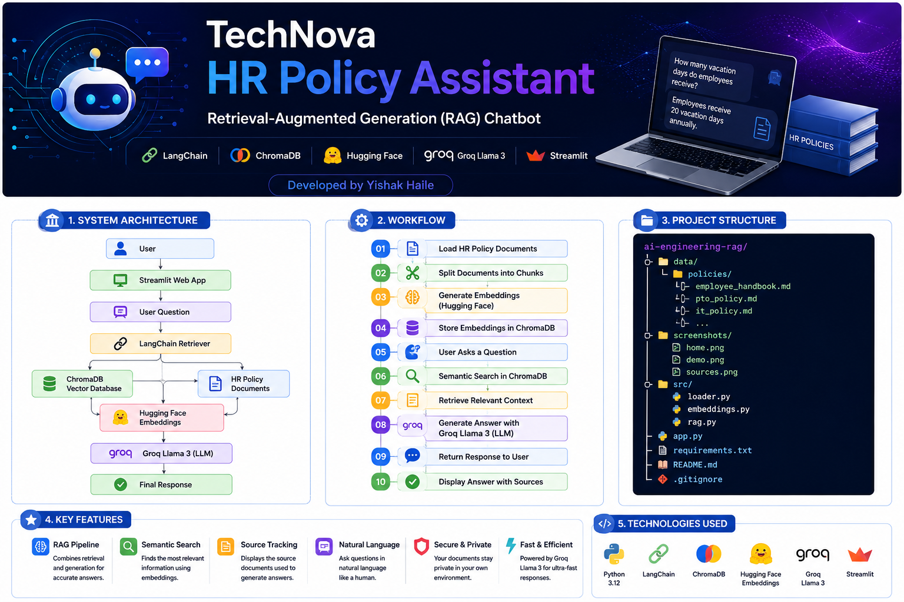
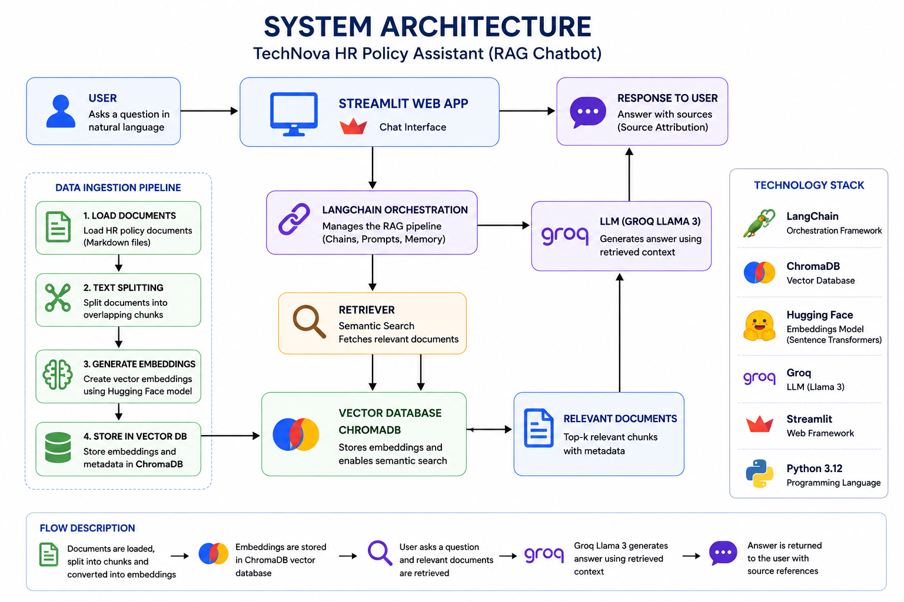
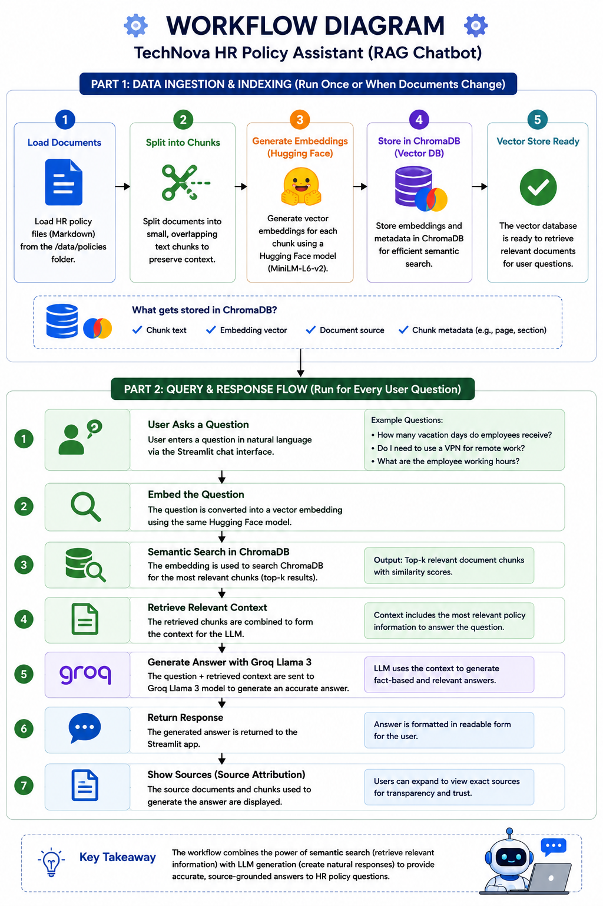

# 🤖 TechNova HR Policy Assistant



**A Retrieval-Augmented Generation (RAG) Chatbot using LangChain, ChromaDB, Hugging Face Embeddings, Groq Llama 3, and Streamlit**

**Developed by: Yishak Haile**

---

## 📌 Project Overview

This project implements a **Retrieval-Augmented Generation (RAG)** chatbot that answers employee questions using company HR policy documents.

Instead of relying only on a language model's memory, the system retrieves the most relevant policy documents from a vector database and uses them as context for generating accurate answers.

---

## 🚀 Features

* 📄 HR policy document ingestion
* ✂️ Automatic text chunking
* 🧠 Hugging Face sentence embeddings
* 🗂 ChromaDB vector database
* 🔍 Semantic document retrieval
* 🤖 Groq Llama 3 integration
* 💬 Streamlit chat interface
* 📚 Source attribution for every answer

---

## 🏗 System Architecture



---

## 🔄 Workflow



---

## 🛠 Technologies Used

| Component            | Technology                |
| -------------------- | ------------------------- |
| Programming Language | Python 3.12               |
| RAG Framework        | LangChain                 |
| Vector Database      | ChromaDB                  |
| Embedding Model      | Hugging Face MiniLM-L6-v2 |
| Large Language Model | Groq Llama 3              |
| Web Framework        | Streamlit                 |
| Version Control      | Git & GitHub              |

---

## 📂 Project Structure

```text
ai-engineering-rag/
├── assets/
├── screenshots/
├── data/
│   └── policies/
├── src/
│   ├── loader.py
│   ├── embeddings.py
│   └── rag.py
├── app.py
├── requirements.txt
├── README.md
└── .gitignore
```

---

## ⚙️ Installation

Clone the repository:

```bash
git clone https://github.com/yishakgha/ai-engineering-rag.git
cd ai-engineering-rag
```

Create a virtual environment:

```bash
python -m venv venv
```

Activate it:

### Windows

```bash
venv\\Scripts\\activate
```

Install dependencies:

```bash
pip install -r requirements.txt
```

---

## 🔑 Environment Variables

Create a `.env` file:

```env
GROQ_API_KEY=your_groq_api_key
```

---

## ▶️ Run the Application

```bash
python -m streamlit run app.py
```

Open:

```text
http://localhost:8501
```

---

## 💬 Example Questions

* How many vacation days do employees receive?
* Can employees reuse passwords?
* Do I need to use a VPN?
* What holidays are paid?
* How do I submit expenses?
* What are the working hours?

---

## 📸 Application Screenshots

### Home Page

Add: `screenshots/home.png`

### Chat Demonstration

Add: `screenshots/demo.png`

### Sources Used

Add: `screenshots/sources.png`

---

## 📈 Results

| Feature              | Status |
| -------------------- | ------ |
| Document Loading     | ✅      |
| Text Chunking        | ✅      |
| Embedding Generation | ✅      |
| ChromaDB Storage     | ✅      |
| Semantic Search      | ✅      |
| Groq Integration     | ✅      |
| Streamlit UI         | ✅      |
| Source Attribution   | ✅      |

---

## 🎯 Skills Demonstrated

* Retrieval-Augmented Generation (RAG)
* Semantic Search
* Vector Databases
* LangChain
* Hugging Face Embeddings
* Large Language Models
* Streamlit Development
* Git & GitHub Workflow

---

## 🔮 Future Improvements

* PDF document upload
* Conversation memory
* User authentication
* Cloud deployment
* Docker containerization
* CI/CD pipeline
* Multi-language support

---

## 👨‍💻 Author

**Yishak Haile**

Senior Information Systems Officer – Commercial Bank of Ethiopia

GitHub: https://github.com/yishakgha

---

## 📄 License

This project is intended for educational and portfolio purposes.
